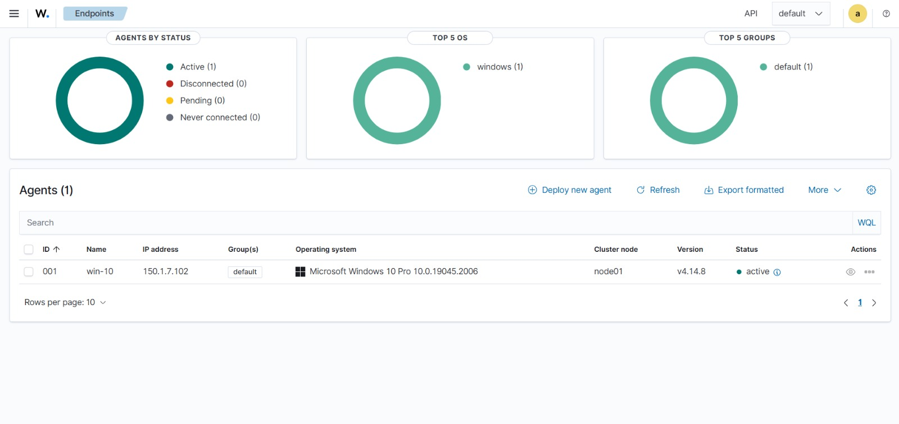
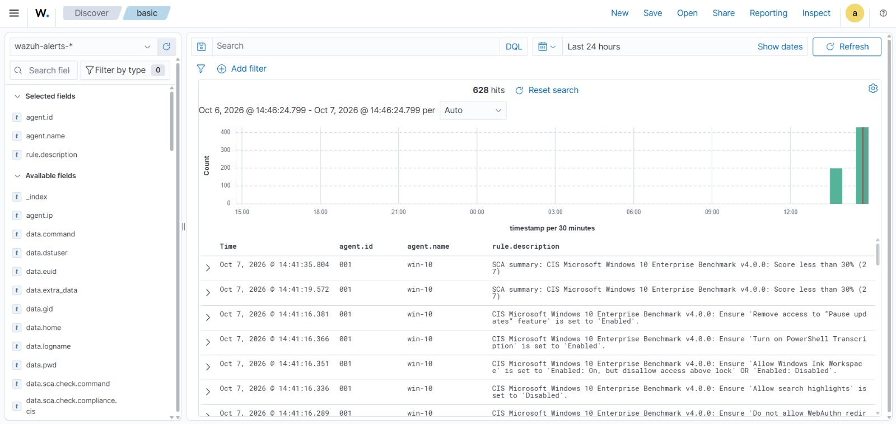
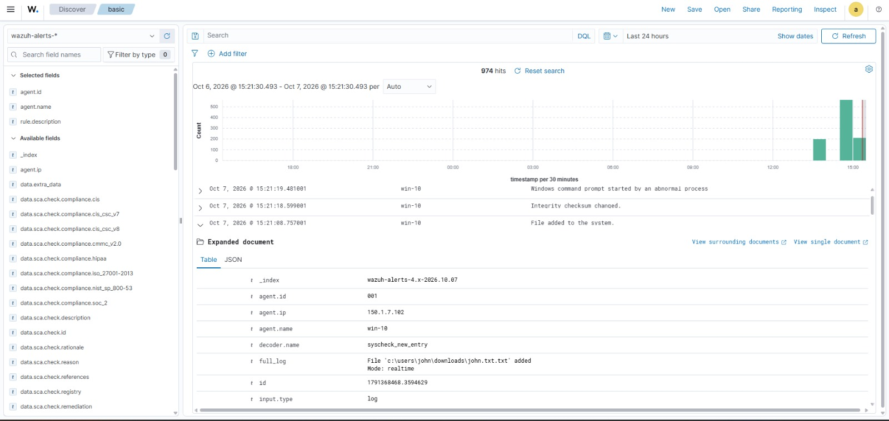
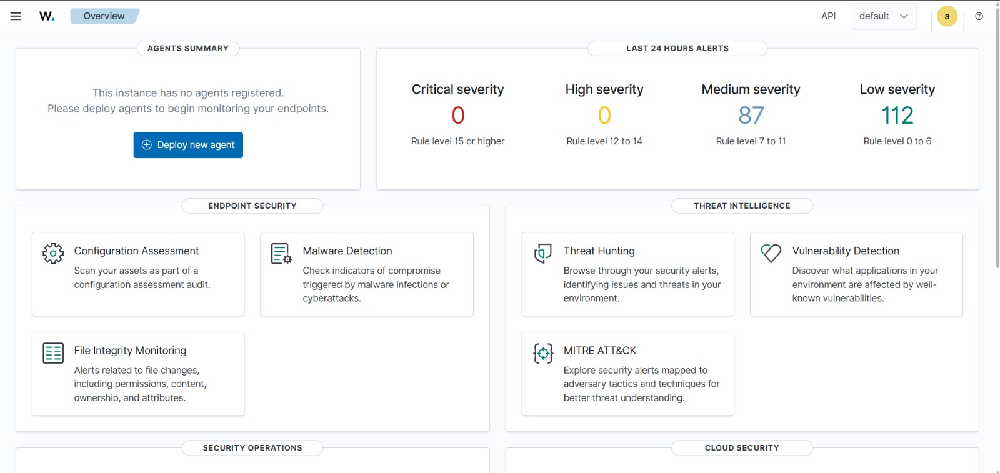

# Wazuh SOC Home Lab

A hands-on Security Operations Center (SOC) lab built on **Wazuh** to practice endpoint monitoring, log analysis, detection, and incident triage. It is built step by step, and every integration is documented with configs, screenshots, and lessons learned.

> **Status:** 🟢 In progress, actively updated
> **Last update:** October 9, 2026

---

## 🎯 Project Goals

- Build a working SIEM/XDR pipeline with Wazuh in a virtualized environment
- Collect high-fidelity endpoint telemetry from Windows using Sysmon
- Detect file tampering using File Integrity Monitoring (FIM)
- Practice alert triage and map detections to MITRE ATT&CK
- Extend the lab with threat intelligence, active response, and network detection

---

## 🏗️ Architecture (current)

```text
┌──────────────────────────┐          ┌──────────────────────────┐
│  Windows 10 Pro (Agent)  │          │ Rocky Linux (VM)         │
│  - Wazuh Agent           │  1514/tcp│ Wazuh All-in-One:        │
│  - Sysmon                ├─────────►│  - Wazuh Manager         │
│  - FIM (syscheck)        │  1515/tcp│  - Wazuh Indexer         │
│                          │ (enroll) │  - Filebeat              │
└──────────────────────────┘          │  - Wazuh Dashboard (443) │
                                      └──────────────────────────┘
          Hypervisor: VMware Workstation on a laptop
```

Full details: [docs/01-architecture.md](docs/01-architecture.md)


---

## ✅ What's Working

| Component | Status | Documentation |
|---|---|---|
| Wazuh all-in-one deployment (Rocky Linux) | ✅ Done | [02-wazuh-installation](docs/02-wazuh-installation.md) |
| Windows 10 agent enrollment | ✅ Done | [03-windows-agent-sysmon](docs/03-windows-agent-sysmon.md) |
| Sysmon integration (Microsoft-Windows-Sysmon/Operational) | ✅ Done | [03-windows-agent-sysmon](docs/03-windows-agent-sysmon.md) |
| File Integrity Monitoring (real-time) | ✅ Done | [04-fim-configuration](docs/04-fim-configuration.md) |
| Security Configuration Assessment (CIS Windows 10) | ✅ Running | [05-detections-observed](docs/05-detections-observed.md) |
| VirusTotal integration | 🔜 Planned | [ROADMAP](ROADMAP.md) |
| Active Response | 🔜 Planned | [ROADMAP](ROADMAP.md) |
| Suricata (network IDS) | 🔜 Planned | [ROADMAP](ROADMAP.md) |
| EVE-NG network lab | 🔜 Planned | [ROADMAP](ROADMAP.md) |


---

## 📸 Highlights

| Agent connected and active | Sysmon events in Wazuh |
|---|---|
|  |  |

| FIM detecting file changes | Wazuh dashboard overview |
|---|---|
|  |  |


---

## 🔍 Key Findings So Far

- Sysmon + Wazuh surfaced PowerShell activity, discovery commands (`net user`), and suspicious file drops within seconds of execution.
- FIM in real-time mode caught file creation, modification, and deletion in monitored directories.
- The CIS Windows 10 benchmark scan scored below 30% on a default install, which makes it a good target for a future hardening exercise.
- Wazuh's own scanning activity can trigger Sysmon-based rules (noise). See [tuning notes](docs/05-detections-observed.md).

---

## 🧰 Tech Stack

`Wazuh 4.14.x` · `Rocky Linux` · `Windows 10 Pro` · `Sysmon` · `VMware Workstation` · `PowerShell` · `MITRE ATT&CK`

*Planned:* `VirusTotal API` · `Wazuh Active Response` · `Suricata` · `EVE-NG`

---

## 📚 Documentation Index

1. [Architecture](docs/01-architecture.md)
2. [Wazuh Installation](docs/02-wazuh-installation.md)
3. [Windows Agent + Sysmon](docs/03-windows-agent-sysmon.md)
4. [File Integrity Monitoring](docs/04-fim-configuration.md)
5. [Detections Observed and Triage Notes](docs/05-detections-observed.md)
6. [Roadmap](ROADMAP.md)

---

## ⚠️ Disclaimer

This is an isolated lab for educational purposes. All IPs, hostnames, and credentials in this repository are sanitized or lab-only.

## 👤 Author

**[Syed Saif Ali Shah]** · [LinkedIn](https://www.linkedin.com/in/syed-saif-ali-shah/) · [saifcyber007@gmail.com]
