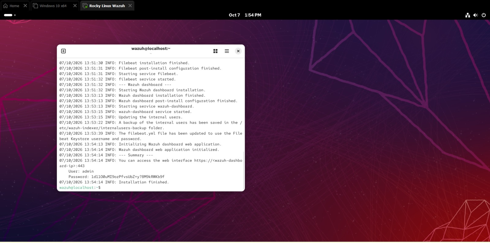

# 02 - Wazuh Installation (All-in-One on Rocky Linux)

## Goal

Deploy the full Wazuh stack (Manager, Indexer, Filebeat, Dashboard) on a single Rocky Linux VM.

## Prerequisites

- Rocky Linux VM with [X] vCPU, [X] GB RAM, [X] GB disk
- Static or reserved IP address
- Internet access from the VM
- `curl` installed and a user with `sudo`

## Steps

### 1. Update the system

```bash
sudo dnf update -y
sudo dnf install -y curl
```

### 2. Download and run the Wazuh installation assistant

```bash
curl -sO https://packages.wazuh.com/4.14/wazuh-install.sh
sudo bash ./wazuh-install.sh -a
```

The `-a` flag installs all components on one host. The installer:

1. Generates certificates and configuration files
2. Installs and starts the Wazuh Indexer
3. Installs the Wazuh Manager and Filebeat
4. Installs the Wazuh Dashboard
5. Prints the admin credentials at the end



> 🔐 **Save the generated admin password somewhere safe and never commit it to GitHub.** Change it after first login.

### 3. Open firewall ports (if firewalld is enabled)

```bash
sudo firewall-cmd --permanent --add-port=1514/tcp
sudo firewall-cmd --permanent --add-port=1515/tcp
sudo firewall-cmd --permanent --add-port=55000/tcp
sudo firewall-cmd --permanent --add-port=443/tcp
sudo firewall-cmd --reload
```

### 4. Log in to the dashboard

Browse to `https://<MANAGER_IP>` and log in as `admin`. Accept the self-signed certificate warning (expected in a lab).


## Verification

```bash
sudo systemctl status wazuh-manager wazuh-indexer wazuh-dashboard filebeat
```

All four services should show `active (running)`.

On first login the dashboard showed **0 agents**, which was expected before enrollment. Alerts were already present (medium and low severity) from the manager's own checks.

## Troubleshooting / Lessons Learned

- [Add anything that went wrong, e.g. low RAM, DNS issues, certificate warnings, firewall blocking]
- Keep the manager and agent on compatible versions. The agent must not be newer than the manager.

## Next Step

[Enroll a Windows agent and add Sysmon →](03-windows-agent-sysmon.md)