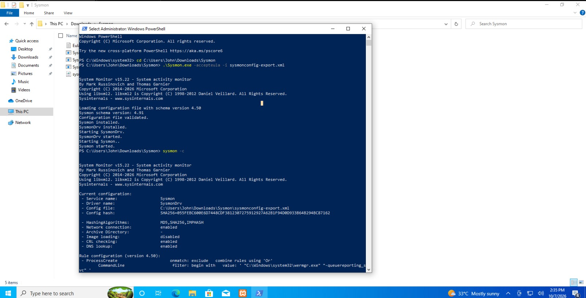
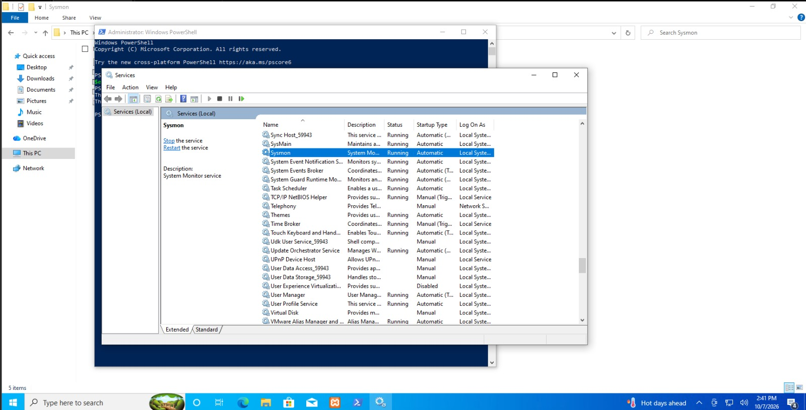
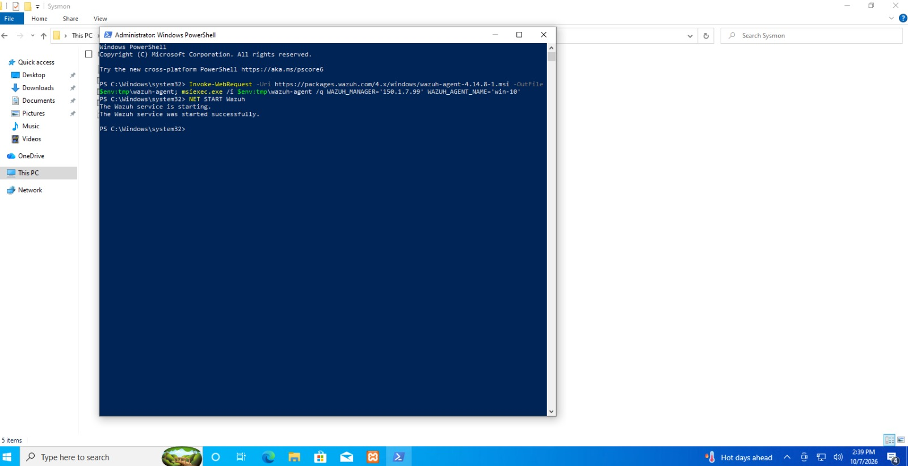
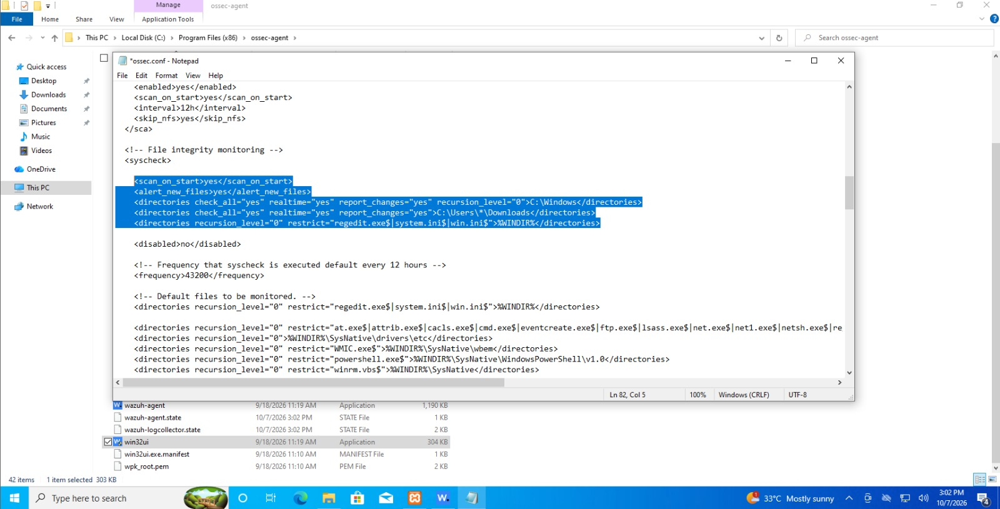

# 03 - Windows Agent and Sysmon Integration

## Goal

Enroll a Windows 10 endpoint into Wazuh and forward detailed Sysmon telemetry for process, network, file, and DNS activity.

## Environment

| Item | Value |
|---|---|
| Endpoint | Windows 10 Pro, build 19045 |
| Agent name | `win-10` |
| Wazuh Agent | 4.14.x |
| Sysmon | v15.x |
| Sysmon config | `sysmonconfig-export.xml` ([SOURCE, e.g. SwiftOnSecurity/sysmon-config]) |

---

## Part A: Install and Configure Sysmon

Run PowerShell **as Administrator** in the folder containing Sysmon.

```powershell
cd C:\Users\<USER>\Downloads\Sysmon
.\Sysmon.exe -accepteula -i sysmonconfig-export.xml
```

Sysmon installed the driver (SysmonDrv) and service, then started both.



### Verify the configuration

```powershell
sysmon -c
```

Confirmed settings from the output:

| Setting | Value |
|---|---|
| Hashing algorithms | MD5, SHA256, IMPHASH |
| Network connection logging | Enabled |
| Image loading | Disabled |
| CRL checking | Enabled |
| DNS lookup | Enabled |

### Verify the service

Open `services.msc` and confirm **Sysmon** is *Running* with startup type *Automatic*.



---

## Part B: Install the Wazuh Agent

```powershell
Invoke-WebRequest -Uri https://packages.wazuh.com/4.x/windows/wazuh-agent-<VERSION>-1.msi -OutFile $env:tmp\wazuh-agent
msiexec.exe /i $env:tmp\wazuh-agent /q WAZUH_MANAGER='<MANAGER_IP>' WAZUH_AGENT_NAME='win-10'
NET START Wazuh
```

Output: *"The Wazuh service was started successfully."*



### Verify enrollment

In the dashboard, go to **Endpoints**. The agent appears as **active** (ID 001, name `win-10`, group `default`).


---

## Part C: Forward Sysmon Logs to Wazuh

Sysmon writes to its own event channel, which the agent does not read by default. Add it to the agent config.

**File:** `C:\Program Files (x86)\ossec-agent\ossec.conf`

```xml
<localfile>
  <location>Microsoft-Windows-Sysmon/Operational</location>
  <log_format>eventchannel</log_format>
</localfile>
```



Restart the agent:

```powershell
Restart-Service -Name wazuh
```

---

## Verification in the Dashboard

**Discover** → index `wazuh-alerts-*` → DQL query:

```text
data.win.system.channel : "Microsoft-Windows-Sysmon/Operational"
```

Sysmon-based alerts appeared (e.g. *"Discovery activity executed"*, *"PowerShell was used to delete files or directories"*).


Expanding an event shows rich Sysmon fields such as `originalFileName`, `parentImage`, `parentCommandLine`, `processGuid`, `user`, and `utcTime`.

---

## Troubleshooting / Lessons Learned

| Problem | Fix |
|---|---|
| No Sysmon events in Wazuh | Confirm the channel name is exactly `Microsoft-Windows-Sysmon/Operational` and restart the agent |
| Agent not connecting | Check the manager IP, port 1514/1515 reachability, and firewall |
| Check agent logs | `C:\Program Files (x86)\ossec-agent\ossec.log` |
| [Add your own issues here] | |

## Next Step

[Configure File Integrity Monitoring →](04-fim-configuration.md)