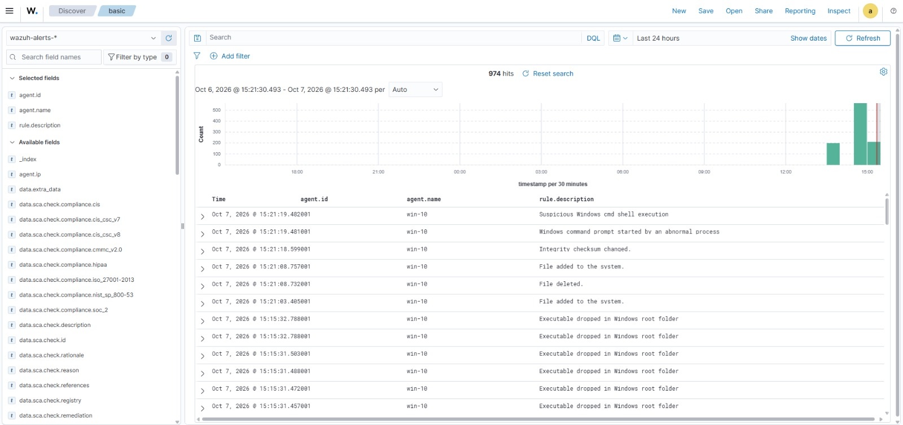

# 04 - File Integrity Monitoring (FIM)

## Goal

Detect file creation, modification, and deletion in sensitive Windows directories in near real time using Wazuh's `syscheck` module.

## Configuration

**File:** `C:\Program Files (x86)\ossec-agent\ossec.conf` (inside `<syscheck>`)

```xml
<syscheck>
  <disabled>no</disabled>
  <frequency>43200</frequency>

  <scan_on_start>yes</scan_on_start>
  <alert_new_files>yes</alert_new_files>

  <!-- Custom monitored paths -->
  <directories check_all="yes" realtime="yes" report_changes="yes" recursion_level="0">C:\Windows</directories>
  <directories check_all="yes" realtime="yes" report_changes="yes">C:\Users\*\Downloads</directories>

  <!-- Default entries below are left unchanged -->
</syscheck>
```

> Replace the paths above with the exact entries from your own `ossec.conf` before publishing.


### What each option does

| Option | Purpose |
|---|---|
| `scan_on_start` | Runs a baseline scan when the agent starts |
| `alert_new_files` | Generates alerts when new files appear |
| `check_all="yes"` | Tracks hashes, size, permissions, owner, and modification time |
| `realtime="yes"` | Reports changes immediately instead of waiting for the periodic scan |
| `report_changes="yes"` | Includes content diffs for text files |
| `recursion_level="0"` | Monitors only the top level of `C:\Windows`, not subfolders |
| `frequency` | Periodic scan interval (43200 s = 12 h) |

> ⚠️ `report_changes` stores copies of monitored text files on the agent. Don't enable it on directories containing sensitive data.

Apply the change:

```powershell
Restart-Service -Name wazuh
```

---

## Test Performed

In the monitored Downloads folder I:

1. Created a new text file (`john.txt.txt`)
2. Modified its contents
3. Deleted it

[Optional: also dropped a harmless `.exe` into `C:\Windows` to trigger the executable-drop detection.]

## Results

| Alert description | Meaning |
|---|---|
| File added to the system | New file detected (syscheck rule 554) |
| Integrity checksum changed | Content or attributes modified (rule 550) |
| File deleted | File removed (rule 553) |
| Executable dropped in Windows root folder | Sysmon-based rule flagging an executable written into `C:\Windows` |
| Windows command prompt started by an abnormal process | Sysmon process-creation rule |
| Suspicious Windows cmd shell execution | Sysmon process-creation rule |



Expanded alert for the new file (decoder `syscheck_new_entry`, mode `realtime`):


### Dashboard query

```text
rule.groups : "syscheck"
```

## Why FIM and Sysmon Together

- **FIM** answers *what changed on disk*: path, hash, before/after.
- **Sysmon** answers *which process did it*: image, parent, command line.

Correlating both gives much stronger context during triage.

## Tuning Notes

- Real-time monitoring of busy directories (like `C:\Windows`) can be noisy, so keep `recursion_level` low or use `restrict` / `ignore`.
- [Add which paths you exclude or tune later.]

## Next Step

[Review detections and triage notes →](05-detections-observed.md)